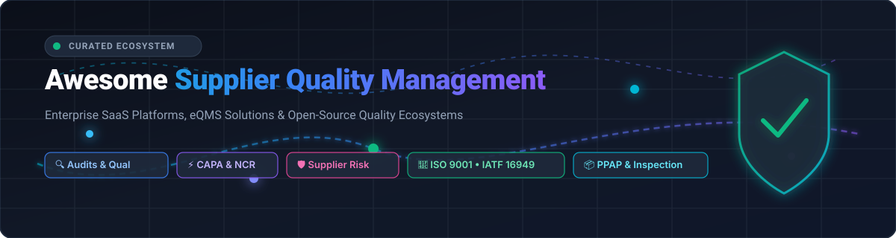

# 🛡️ Awesome Supplier Quality Management (SQM)

  <strong>Curated ecosystem of enterprise SaaS platforms, eQMS suites, and open-source quality frameworks.</strong> 
  <em>Accelerating Supplier Qualification, Audits, CAPA/NCR, Incoming Inspection, PPAP/APQP, Risk, &amp; Global Compliance across the Supply Base.</em>

  
  
  
  
  
  

---

## 📌 Table of Contents
- [📖 Overview & Key Standards](#-overview--key-standards)
- [☁️ SaaS / Commercial SQM & eQMS Platforms](#️-saas--commercial-sqm--eqms-platforms)
- [💻 Open-Source Quality Management Projects](#-open-source-quality-management-projects)
- [🏗️ Building Custom Supplier Quality Systems](#️-building-custom-supplier-quality-systems)
- [🤝 How to Contribute](#-how-to-contribute)
- [📈 Star History](#-star-history)
- [📄 Disclaimer](#-disclaimer)

---

## 📖 Overview & Key Standards

**Supplier Quality Management (SQM)** encompasses the processes, systems, and tools used by manufacturing, life sciences, aerospace, automotive, and high-tech organizations to ensure that incoming parts, raw materials, assemblies, and third-party vendors meet rigorous specifications and regulatory mandates.

### Core SQM Functional Pillars
* 🔍 **Supplier Qualification & Onboarding**: Vendor audits, capability assessments, quality agreements, and compliance questionnaires.
* ⚡ **CAPA & Non-Conformance Management (NCR/SCAR)**: Supplier Corrective Action Requests, 8D problem-solving, root-cause analysis, and verification of effectiveness.
* 📦 **Incoming Inspection & PPAP/APQP**: Production Part Approval Process, First Article Inspection (FAI), sampling plans (AQL/C=0), and Certificate of Analysis (CoA) verification.
* 🛡️ **Supplier Risk & Governance**: ESG, material compliance (REACH, RoHS, PFAS, TSCA), geopolitical risk scoring, and multi-tier supply network transparency.
* 📜 **Regulatory Alignment**: ISO 9001, IATF 16949 (Automotive), ISO 13485 & 21 CFR Part 820/Part 11 (Medical Devices), AS9100 (Aerospace), and GMP/FDA standards.

---

## ☁️ SaaS / Commercial SQM & eQMS Platforms

> 📊 **Market Overview**: The global Quality Management Software (eQMS) and Supplier Quality Management sector is estimated at **~$11.5 Billion (2025/2026)** and forecasted to exceed **~$22 Billion by 2032** (~10.2% CAGR). The market is **moderately-to-highly fragmented** with no single "winner-take-all" monopoly. It is divided between enterprise ERP/PLM ecosystem giants (SAP, Hexagon, Fortive), specialized regulated-industry eQMS unicorns (MasterControl, Greenlight Guru, Qualio), and multi-tier supply chain ESG/compliance platforms (Assent).

*The table below is sorted descending by company scale, revenue, and valuation:*

| 🏢 Platform | 💰 Company Valuation / Revenue | 📝 Description &amp; Core Capabilities | 🏷️ Starting Pricing | 🎁 Free Tier / Trial Limits |
| :--- | :--- | :--- | :--- | :--- |
| **[SAP Supplier Quality](https://www.sap.com/)** | **~$250B+ Market Cap** (~$34B+ Annual Rev; Public: SAP) | Comprehensive supplier quality integration within the SAP ecosystem (SAP S/4HANA Cloud QM &amp; SAP Business Network / Ariba) linking supplier audits, goods receipt inspections, and SCARs directly with enterprise ERP/MRP. | Starts at ~$1,500/month (~$18,000/year base subscription for SAP S/4HANA Cloud QM / Ariba Quality modules) | Free forever for suppliers via SAP Business Network Standard Account (unlimited basic PO/invoicing/quality notifications); 30-day sandbox trial for SAP S/4HANA Cloud |
| **[Intelex](https://www.intelex.com/)** | **~$25B+ Parent Market Cap** (Fortive Corporation; ~$150M+ ARR) | Highly configurable enterprise EHSQ platform with modular supplier quality, audit management, CAPA, vendor performance scoring, and operational governance. | Starts at $49/user/month (billed annually; 25-user minimum ~$14,700/year base) | 14-day guided sandbox trial (up to 5 users, pre-configured QMS/EHS modules); no perpetual free tier |
| **[MasterControl](https://www.mastercontrol.com/)** | **~$1.3B Valuation** (~$150M+ ARR; Backed by Sixth Street) | Category-leading cloud QMS platform widely adopted across life sciences, pharmaceutical, and medical device manufacturing for supplier qualification, document control, training, CAPA, and audits. | Starts at ~$20,000/year (approx. $100–$150/user/month base; ~$45,000/year for 10-user environment) | 14-day guided interactive sandbox trial upon demo qualification; no perpetual free tier |
| **[Ideagen](https://www.ideagen.com/)** | **~$1.3B Valuation** (£1.09B PE acquisition by Hg Capital; ~$200M+ ARR) | Global quality, safety, and compliance suite (including Q-Pulse and Ideagen Quality Management) deployed for aerospace, healthcare, and manufacturing audits, document control, and multi-tier supplier oversight. | Starts at ~$25,000/year (approx. $80–$150/user/month with standard onboarding) | 30-day guided evaluation sandbox upon sales request (up to 3 test users); no perpetual free tier |
| **[ETQ Reliance](https://www.etq.com/)** | **$1.2B Acquisition Valuation** (Hexagon AB; ~$28B Parent Market Cap) | Enterprise-grade QMS platform with pre-built best-practice workflows for supplier quality management, audits, non-conformances (NCR), CAPA, and supply-chain risk analytics. | Starts at ~$18,000/year (approx. $100–$150/user/month; ~$50,000/year for 10-user enterprise suite) | 30-day proof-of-concept sandbox trial upon sales qualification (up to 5 users); no perpetual free tier |
| **[Greenlight Guru](https://www.greenlight.guru/)** | **~$1.2B Valuation** ($120M+ investment from JMI Equity; ~$60M+ ARR) | Modern QMS and product development platform purpose-built for medical device and life science companies, covering design controls, CAPA, risk, and supplier quality workflows. | Starts at $200/user/month (approx. $12,000–$20,000/year base package for up to 5 core users) | 14-day guided sandbox workspace trial upon demo qualification; no perpetual free tier |
| **[Assent](https://www.assent.com/)** | **~$1.0B+ Valuation** (Unicorn backed by Warburg Pincus; ~$100M+ ARR) | Supply-chain sustainability and product compliance platform used for supplier data collection, REACH/RoHS/PFAS reporting, and supplier risk governance. | Starts at ~$10,000/year (~$833/month base for core supply chain &amp; compliance modules) | No perpetual buyer free tier; 0-day self-serve trial (Free forever access provided to invited suppliers via Assent Supplier Portal) |
| **[MetricStream](https://www.metricstream.com/)** | **~$500M+ Valuation** (~$100M+ Annual Revenue; Enterprise GRC Leader) | Enterprise Governance, Risk, and Compliance (GRC) and quality platform supporting supplier risk management, third-party audits, and regulatory compliance at scale. | Starts at ~$30,000/year (base enterprise platform tier for supplier governance &amp; risk) | 30-day proof-of-concept sandbox trial upon enterprise qualification; no perpetual free tier |
| **[Qualio](https://www.qualio.com/)** | **~$250M+ Valuation** ($50M+ Series B; ~$25M+ ARR) | Fast-growing cloud eQMS optimized for medical device, biotech, and life sciences startups/scale-ups, supporting supplier files, audits, deviations, and CAPA. | Starts at $200/user/month (Foundation plan starts at ~$12,000–$20,000/year for up to 5 Edit users + unlimited view users) | 14-day guided proof-of-concept trial upon demo request; no perpetual free tier |
| **[QT9 Software](https://qt9software.com/)** | **~$20M+ Revenue / Valuation** (Established Mid-Market Provider) | Integrated Quality Management Software suited to mid-market discrete and process manufacturers, covering supplier quality, CAPA, audits, and calibration. | Starts at $80/user/month (approx. $2,500–$3,600/year minimum base depending on module package) | 7-day full-access cloud free trial (unlimited modules, no credit card required); no perpetual free tier |

---

## 💻 Open-Source Quality Management Projects

*Community-driven open-source projects, quality inspection modules, and workflow scaffolds for building custom supplier quality and audit systems. Sorted descending by GitHub stars:*

- **[Odoo Quality](https://github.com/odoo/odoo)**   
  Comprehensive open-source ERP with a dedicated Quality Management module supporting incoming supplier quality checks, automated control points, non-conformance tracking, Quality Alerts, and vendor evaluation workflows.

- **[ERPNext Quality Module](https://github.com/frappe/erpnext)**   
  Full-featured open-source ERP featuring an integrated Quality Management Module with Supplier Scorecards, Quality Inspection against purchase receipts, Quality Procedures, and CAPA / Quality Actions.

- **[Carbon](https://github.com/crbnos/carbon)**   
  Modern, high-performance open-source ERP, MES, and QMS for manufacturing with quality control, material traceability, batch genealogies, and supplier oversight capabilities.

- **[OpenBoxes](https://github.com/openboxes/openboxes)**   
  Open-source supply chain and inventory management software with lot-level tracking, expiration monitoring, receiving quality control, and supplier issue tracking.

- **[ProcessMaker](https://github.com/ProcessMaker/processmaker)**   
  Open-source workflow and business process management (BPM) platform frequently used to automate supplier qualification approvals, audit checklists, Non-Conformance Reports (NCR), and CAPA pipelines.

- **[SENAITE LIMS](https://github.com/senaite/senaite.core)**   
  Open-source enterprise Laboratory Information Management System (LIMS) for incoming material testing, supplier batch verification, sample tracking, and ISO/IEC 17025 compliance.

- **[GSTT QMS Template](https://github.com/GSTT-CSC/QMS-Template)**   
  Open-source ISO 13485 and ISO 9001 compliant Quality Management System framework and template documentation for regulated software, medical devices, and supplier risk controls.

- **[OpenQMS.net](https://github.com/haowangbe/OpenQMS.net)**   
  Cloud-native, lightweight open-source QMS designed for life sciences, covering document control, change management, training records, and supplier audits.

- **[QAtrial](https://github.com/MeyerThorsten/QAtrial)**   
  Open-source (AGPL) quality management system featuring CAPA, audit trails, risk management, 21 CFR Part 11 compliant electronic signatures, and supplier qualification modules.

- **[MSP_QMS](https://github.com/jsimpsonn/MSP_QMS)**   
  Modern web-based Quality Management System built with React and Next.js for tracking internal/supplier audits, CAPA resolution, and compliance with IATF 16949 &amp; ISO 9001 standards.

---

## 🏗️ Building Custom Supplier Quality Systems

For organizations designing custom or hybrid supplier quality architectures:
1. **Open Workflow + Issue Tracking**: Combine workflow engines (e.g., ProcessMaker, Camunda) with structured GitHub/GitLab issue templates for 8D CAPA and SCAR resolutions.
2. **ERP-Integrated Quality Inspection**: Leverage ERPNext or Odoo Quality modules to automate receiving inspections triggered upon purchase order receipts.
3. **Audit Trails & Versioned Scaffolds**: Store standard operating procedures (SOPs), supplier agreements, and Approved Supplier Lists (ASL) in version-controlled markdown repositories with automated approval actions.
4. **LIMS & Material CoA Verification**: Feed physical test results and Certificate of Analysis data from SENAITE LIMS into vendor quality scorecards.

---

## 🤝 How to Contribute
1. Fork the repository.
2. Add or update entries in `README.md` following the existing format.
3. Ensure SaaS entries include verified starting pricing, company scale, and free trial limits.
4. Ensure open-source entries include a valid GitHub link and social star badge.
5. Submit a Pull Request with a clear description of changes.

---

##  Star History

---

## 📄 Disclaimer
- This repository is a **community-curated index** and does not constitute formal legal, regulatory, or quality system advice.
- Supplier quality software deployed in regulated environments (FDA 21 CFR Part 820/Part 11, ISO 13485, IATF 16949, AS9100) must undergo formal Computer Software Validation (CSV) / Computer Software Assurance (CSA) before production use.

---

  Maintained by <a href="https://github.com/ishandutta2007">Ishan Dutta</a> and contributors. Star ⭐ this repository if you find it helpful!

